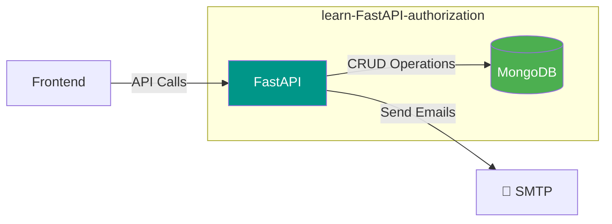

# 📚 Содержание  
- [🚀 Описание проекта](#описание-проекта-learn-fastapi-authorization)  
- [🛠 Установка и запуск](#установка-и-запуск-проекта)  
- [🏗 Архитектура](#архитектура)  
- [⚙️ Функционал](#функционал)  
- [🧰 Стек технологий](#технологии)  
- [📝 TODO](#todo)  

---

# 🚀 Описание проекта *learn-FastAPI-authorization*  
**Это бэкенд-приложение для управления задачами** и демонстрации навыков:  
- 🔐 *Полная авторизация*: OAuth2 + JWT + подтверждение по email  
- 🚀 *Высокая производительность*: Async FastAPI + MongoDB  
- 📦 *Подготовлено к запуску*: Докер  
- ✉️ *Работа с email*: Интеграция SMTP  

&gt; 💡 *Цель*: Показать работодателю, что вы разбираетесь в современном бэкенд-стеке.  

---

# 🛠 Установка и запуск  

## ⚠️ Предварительные требования  
- **Docker** (v20.10.0+)  
- **Docker Compose** (v1.29.0+)  
- **Git**  

## 🚦 Пошаговая инструкция  

### 1. Клонирование репозитория  
```bash
git clone https://github.com/Marat22/learn-FastAPI-authorization.git
cd learn-FastAPI-authorization
```

### 2. Настройка окружения  
Создайте файл `.env` по следующему примеру:  
```ini
# 🔑 JWT
SECRET_KEY=your_super_secret_key_here
ALGORITHM=HS256

# 🍃 MongoDB
MONGO_INITDB_ROOT_USERNAME=admin
MONGO_INITDB_ROOT_PASSWORD=secure_password

# ✉️ SMTP (пример для Gmail)
MAIL=your@gmail.com
MAIL_PASSWORD=app-specific-password
SMTP_SERVER=smtp.gmail.com
```

### 3. Запуск  
```bash
docker compose up -d --build
```
**Готово!** Сервер доступен на [http://localhost:8000](http://localhost:8000)  

### 4. Дополнительные команды  
| Действие | Команда |  
|----------|---------|  
| Остановка | `docker compose down` |  
| Логи FastAPI | `docker compose logs -f web` |  
| Логи MongoDB | `docker compose logs -f mongo` |  
| Документация API | [http://localhost:8000/docs](http://localhost:8000/docs) |  

---

# 🏗 Архитектура  


## 🗃 Структура БД  
```javascript
{
    _id: ObjectId,  // Уникальный идентификатор пользователя
    username: str,  // Имя пользователя
    email: str,      // Электронная почта пользователя
    hashed_password: str,  // Хешированный пароль пользователя
    is_active: bool,  // Подтвердил почту или нет
    todo: [           // Список групп задач пользователя
        {
            _id: ObjectId,  // Уникальный идентификатор группы задач
            title: str,     // Название группы задач
            order_num: int, // Порядковый номер группы задач
            tasks: [        // Список задач в группе
                {
                    _id: ObjectId,  // Уникальный идентификатор задачи
                    title: str,     // Название задачи
                    description: str,  // Описание задачи
                    order_num: int, // Порядковый номер задачи
                },
                ...
            ]
        },
        ...
    ]
}
```

### ❓ Почему такая структура?  
- ⚡ **Быстро** – все данные пользователя загружаются за 1 запрос  
- 🧩 **Просто** – не нужны сложные JOIN-операции  
- 🏆 **Оптимально** – отлично подходит для небольших объемов данных  

&gt; 💡 *Пример из кода*:  
&gt; ```python
&gt; @tasks_router.get(/)
&gt; async def get_tasks(user = Depends(get_current_user)):
&gt;     return user[todo]  // 🎯 Все задачи – в одном месте!
&gt; ```

---

# ⚙️ Основной функционал  

## 🔐 Аутентификация  
- 📝 Регистрация с подтверждением по email  
- 🔑 OAuth2 + JWT в HTTP-only cookies  
- ✉️ Восстановление пароля через почту  

## 👨‍💻 Управление задачами  
- ✅ CRUD для задач и групп  
- 🔄 Сортировка по `order_num`  
- 🛡 Автоматическая привязка к пользователю  

## ✨ Дополнительно  
- 🐳 Готовый Docker-образ  
- ⚡ Async I/O для всех операций  

---

# 🧰 Стек  
| Категория | Технологии |  
|-----------|------------|  
| **Backend** | FastAPI, Pydantic, OAuth2 |  
| **База данных** | MongoDB (async) |  
| **Инфраструктура** | Docker, Docker Compose |  
| **Коммуникация** | SMTP, MIME |  

---

# 📝 TODO  
- [ ] Продакшн-деплой  
- [ ] Написать тесты (pytest)  
- [ ] Пагинация задач  
- [ ] Сроки выполнения задач  
- [ ] Приоритеты для задач (High/Medium/Low)  
- [ ] Кеширование (Redis)  